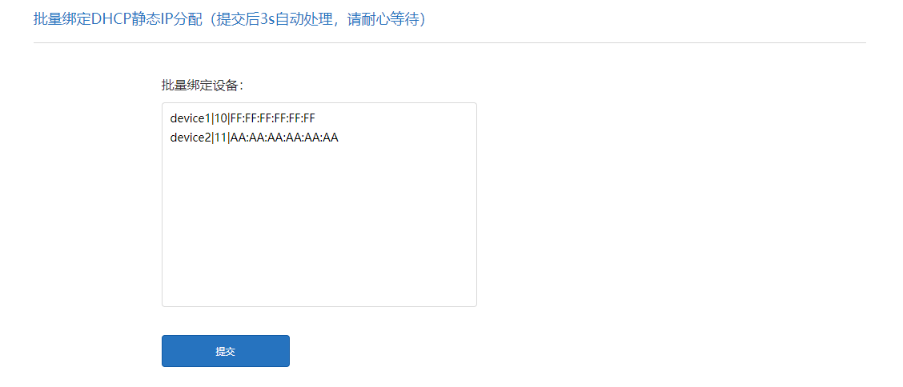

# XiaoMi路由器 DHCP静态IP分配批量填充工具

## 语言

简体中文|[English](./README_en.md)


## 安装

使用`Tampermonkey`安装此脚本，使用`http://192.168.31.1`访问路由器管理界面。

> 若自定义网关IP，则需要自己手动修改一下匹配规则

## 使用教程

1. 🔍 打开 `高级设置>DHCP静态IP分配` 页面。

2. ⌛️ 等待3s脚本加载，批量填写框将会加载管理页最底部。


3. 📝 依照格式填写需要绑定的设备，并点击提交按钮。



格式：`设备名称|IP地址最后一格数字|MAC地址`

解释：
- 文本框中一行代表一个设备。
- IP地址最后一格数字，若需要绑定的IP地址为`192.168.31.10`，则只需要填入`10`。

示例：
```text
device1|10|AA:AA:AA:AA:AA:AA
device2|11|BB:BB:BB:BB:BB:BB
```

4. 🔧 绑定设备对话框将会弹出，等待程序提示填充完成对话框。


5. 🎉 点击`一键绑定`按钮，自此操作全部完成。

