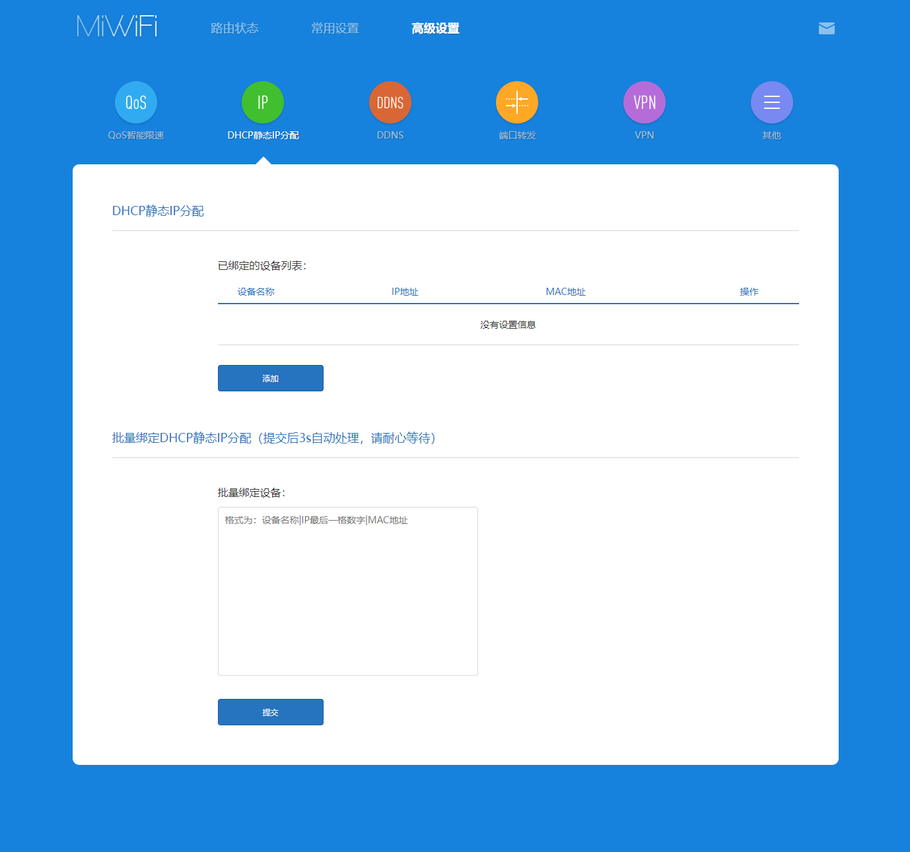
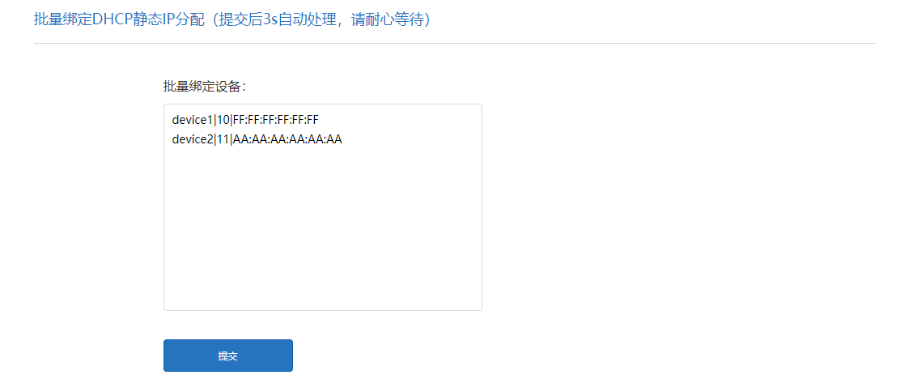
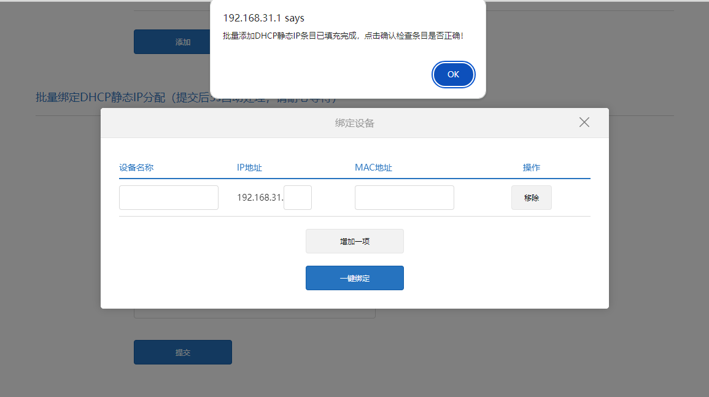
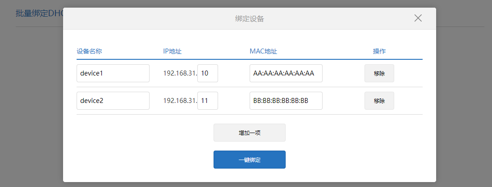

# XiaoMi Router Static DHCP Batch Filling Tool

## Language

[简体中文](./README.md)|English

## Installation

Install this script using `Tampermonkey`, and access the router management interface using `http://192.168.31.1`.

> If you have customized the gateway IP, you will need to manually modify the matching rules.

## Usage Tutorial

1. 🔍 Open the `Advanced Settings>Static DHCP` page.

2. ⌛️ Wait for 3 seconds for the script to load; the batch filling box will load at the bottom of the management page.



3. 📝 Fill in the devices to be bound according to the format, and click the submit button.



Format: `Device Name|Last digit of IP address|MAC Address`

Explanation:
- Each line in the text box represents one device.
- For the last digit of the IP address, if the IP to be bound is `192.168.31.10`, then you only need to enter `10`.

Example:
```text
device1|10|AA:AA:AA:AA:AA:AA
device2|11|BB:BB:BB:BB:BB:BB
```

4. 🔧 A binding device dialog will pop up; wait for the program to prompt that the filling of the dialog is complete.


5. 🎉 Click the One-click Bind button, and with that, all operations are completed.
